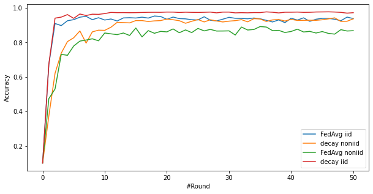

# Federated Learning with Flower framework

## How to run

**Note: This implementation runs on Mac. Then the device is set "mps". You should change the device according to your hardware.

### Create dataset

This step will create iid or non-iid datasets for clients from MNIST dataset

For example: To reproduce the experiment desribed in the (paper)[].
```bash
python create_dataset.py --type noniid\
                         --data_dir ./datasets/flmnist
                         --num_clients 100\
                         --num_shards 200
```

In this case, the output is a directory **./datasets/flmnist_noniid_100clients/** which stores multiple data partitions of each clients

### Approach 1: Start server-clients manually

Start the server first

```bash
python server.py --rnd 50 --sample_fraction 1.0 --num_clients 2\
                 --batch_size 32 --num_epochs 3 --lr 0.001 --save_dir save_models
```

Then open the other terminals to start each client.
For example, start the client 1.

```bash
python client.py --cid 1\ 
                --data_dir datasets/flmnist_iid_2clients
```

### Approach 2: Start the simulation with many clients

```bash
python simulation.py --sample_fraction 0.1 --num_clients 100 --batch_size 10 \
                    --num_epochs 5 --lr 0.001 --save_dir save_models \
                    --fed_dir datasets/flmnist_noniid_100clients --rnd 50
```

To know more about arguments, please use '--h'.

## Some results

2 clients
- Learning rate of each client is 0.001
- Strategy: FedAvg
- B=32, E = 3

| Decay | Data distribution | Last round | Best Acc@Round |
| ----- | ----------------- | ---------- | -------------- |
| 1.0   | iid               | 0.9388     | 0.9537@19      |
| 1.0   | non iid           | 0.8686     | 0.8925@36      |
| 0.5   | iid               | 0.9730     | 0.9779@47      |
| 0.5   | non iid           | 0.9376     | 0.9431@48      |



10 clients
- Learning rate of each client is 0.001
- Strategy: FedAvg
- B=10, E = 5

| Decay | Data distribution | Last round | Best Acc@Round |
| ----- | ----------------- | ---------- | -------------- |
| 1.0   | iid               | 0.838      | 0.9096@19      |
| 1.0   | non iid           | 0.5991     | 0.6953@31      |
| 0.5   | iid               | 0.918      | 0.9277@49      |
| 0.5   | non iid           | 0.6438     | 0.7653@37      |


## Some resources to start Federated Learning

- Introduction Slides for FL: https://namhoonlee.github.io/courses/optml/s14-fl.pdf
- Video tutorial: https://www.youtube.com/watch?v=nBGQQHPkyNY
- Flower tutorial: https://www.youtube.com/watch?v=Ky6TicaPfVI&t=2656s